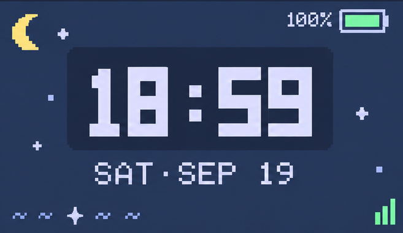
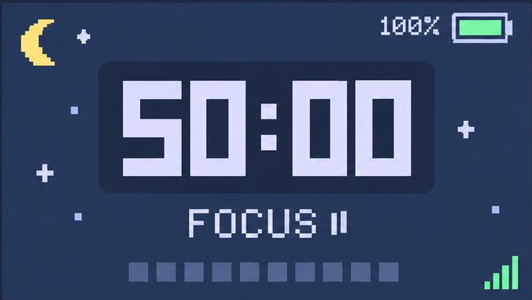
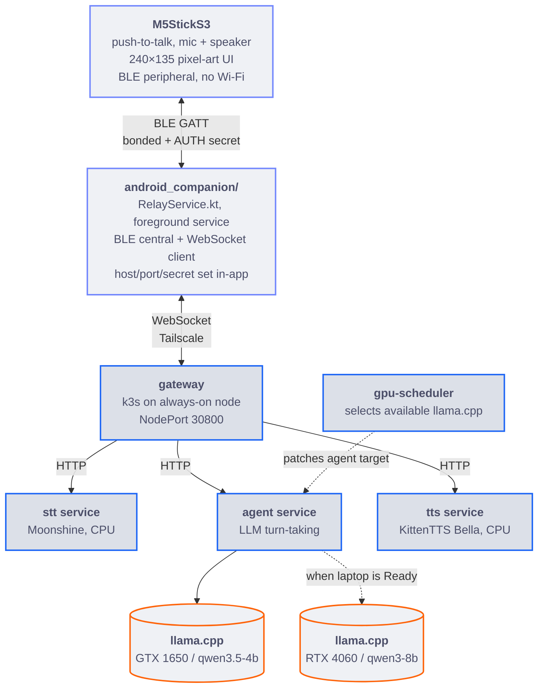
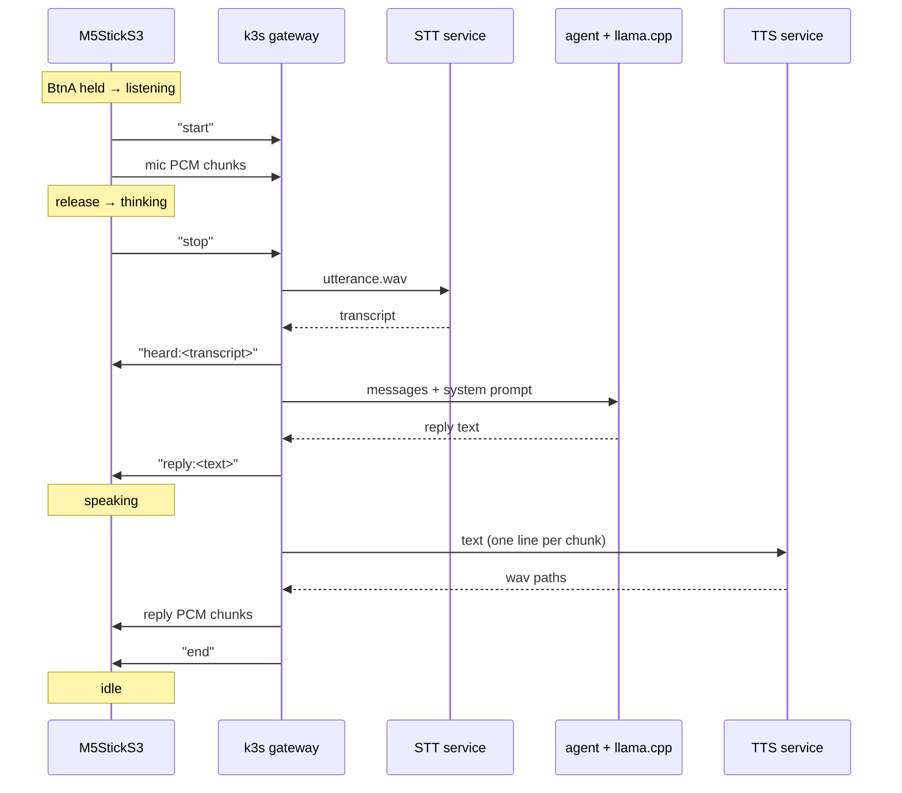
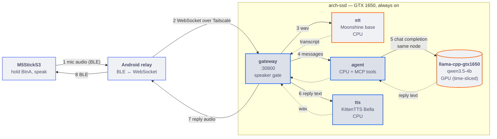
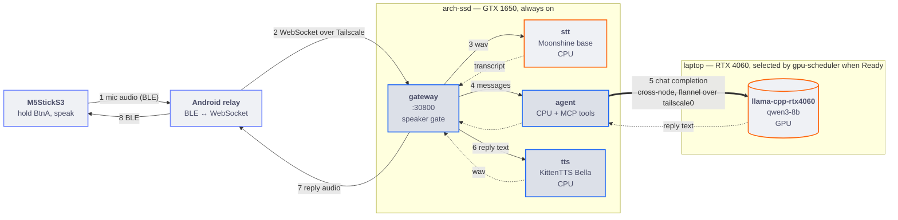
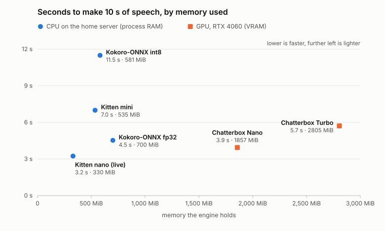

# aicompanion

A voice assistant: mic → STT → llama.cpp (LLM) → TTS → speaker. In Kubernetes
STT is Moonshine and TTS is KittenTTS, both on CPU via sherpa-onnx; locally the
defaults are faster-whisper and VITS.
The primary device path is M5StickS3 → BLE → Android relay → the k3s gateway
and split STT/agent/TTS services. `bridge_server.py` remains the standalone
development fallback, and `chat_loop.py` runs the same backends with this
machine's local mic/speaker. TTS is
swappable (`--tts-backend kitten` (the deployed default), `kokoro-onnx`,
`kokoro`, `vits`, `chatterbox`, or `elevenlabs`), and so is STT (`moonshine`,
`parakeet`, `faster-whisper`) — see "Swapping backends" below. In the cluster,
`tools/switch-backend.sh` swaps either one live.

## What the M5Stick does today

- **Voice chatbot** — hold BtnA to talk, release to send; STT → LLM → TTS →
  speaker, same pipeline as the desktop entrypoint.
- **Speaker verification** ("voice recognition") — replies are gated to the
  enrolled owner's voice (WeSpeaker ECAPA-TDNN-512), so someone else in the
  room doesn't get an answer. See `docs/voice-pipeline.md`.
- **Three screens, cycled by tapping BtnA** (a hold still talks from any of
  them): Rina's animated pixel-art face, a Catppuccin-themed **clock**
  (no on-board RTC, so it's set from a `TIME_SYNC` BLE frame the phone sends
  on connect rather than NTP), and a **pomodoro timer** (50 min focus / 10 min
  break by default — BtnB click starts/pauses, BtnB double-click resets).
- **Proactive/unprompted speech** — reminders, encouragement, or a
  build-finished ping can all speak without a button press (see "Unprompted
  lines" below).
- **BLE transport** — the Stick talks to the Android relay entirely over
  Bluetooth Low Energy now (no Wi-Fi at all in `firmware/m5stick_bridge/`):
  bonding plus an app-layer shared-secret handshake, relayed to
  the k3s gateway's WebSocket by the `android_companion/` phone app. Full
  design and the real-hardware verification log: `docs/ble-migration.md`.
- Powering the device off is the **physical power button** (double-click),
  not a firmware feature — see `docs/firmware-notes.md`.

Still tracked in `TODO.md`: wake word activation, an IMU wrist-raise gesture
wake, haptic feedback, voice isolation, and a BLE soak test (hours-long
connection, reconnect after reboot/deep-sleep; Start → Stop → Start and
Bluetooth-toggle reconnects are already verified on the device).

### On-device screens

The Stick cycles between Rina's animated face, a clock, and a pomodoro timer
with BtnA. The repository includes the source sprite and real M5StickS3
captures of the three screens:

<table>
  <tr>
    <th>Rina</th>
    <th>Clock</th>
    <th>Pomodoro</th>
  </tr>
  <tr>
    <td></td>
    <td></td>
    <td></td>
  </tr>
</table>

## Architecture

The k3s route is the normal device path. The standalone entrypoints remain
useful for local development and isolated debugging.



`tools/termux_relay.py` (Termux, Wi-Fi hotspot + Tailscale) did this same
relay job before the BLE migration and still works standalone, but
`android_companion/` is what's actually used today — see "Using the Stick"
below.

In the standalone/local path, the heavy TTS models each run in their **own
conda env** as a long-lived
subprocess, because their torch/CUDA pins conflict with each other and with
the `chat` env. `voicepipe/subproc.py` owns that plumbing, so a backend only
declares the command to run. faster-whisper and the HTTP-based LLM backends
need no such isolation — whisper runs in-process and the model server is
reached over HTTP.

One turn over the gateway WebSocket, including where the on-device UI changes
state. `services/gateway/app.py` and the standalone `bridge_server.py`
implement the same wire protocol; on the Stick's side,
`android_companion/RelayService.kt` translates
it 1:1 to/from the BLE byte-envelope frames described in
`docs/ble-migration.md` (`START`/`STOP`/`HEARD`/`STATUS`/`REPLY`/
`AUDIO_CHUNK`/`END`), so the diagram below is accurate for both the pre-BLE
and current BLE setups — only the transport between "S" and "B" changed:



Every turn sends exactly one `end`, including failures — the Stick stays in
its speaking state until it arrives.

## Current Kubernetes path

The production route is:

```text
M5StickS3 → BLE → Android relay → gateway NodePort 30800
  → STT / agent / TTS services → scheduler-selected llama.cpp server
```

The k3s cluster has two GPU nodes. `arch-ssd` is the always-on GTX 1650 node;
the laptop node is an optional RTX 4060 worker. The GPU scheduler patches the
agent's `LLM_HOST` and `LLM_MODEL`: the preferred route is `qwen3-8b` on the
RTX 4060, with `qwen3.5-4b` on the GTX 1650 as the fallback. MCP remains
available on both routes because the MCP server runs in the CPU-side agent
container, independently of the model server. STT, TTS, gateway, agent,
and the core observability services are pinned to `arch-ssd`; DCGM Exporter
still runs on both GPU nodes. The laptop can therefore disappear without
taking down the primary route or monitoring. See
[`deploy/kubernetes/README.md`](deploy/kubernetes/README.md).

### One turn, in each GPU mode

The loop is the same in both modes; the only thing that changes is which
llama.cpp server the `agent` calls, and therefore where the LLM step runs.

**Laptop offline — GTX 1650 only (fallback).** Every hop after the phone stays
on `arch-ssd`. STT and the 4B model share the 1650 through GPU time-slicing,
so the LLM step is the smaller model competing for the same 4 GB card.



**Laptop Ready — RTX 4060 online (preferred).** The same services stay on
`arch-ssd`; only step 5 moves. The `agent` calls the 8B model on the laptop,
crossing nodes over the flannel VXLAN overlay on `tailscale0`, and the 1650 is
left to STT alone.



Switching modes is automatic. `gpu-scheduler` re-evaluates every 10 seconds and
on every 4060 node event, from the whole picture rather than one transition: the
4060 counts as up only when its node is `Ready` **and** `llama-cpp-rtx4060` is
serving. Then:

- **4060 up**: it patches `agent` to `LLM_HOST=http://llama-cpp-rtx4060:8080/v1`,
  `LLM_MODEL=qwen3-8b`, and once that rollout has finished **and the 4060 has been
  up for 60 seconds** it scales `llama-cpp-gtx1650` to zero, freeing about 1 GiB
  of RAM and 3.4 GiB of VRAM on the home server. The 60 s debounce keeps a
  laptop that sleeps and wakes from making the 1650 reload its model every time.
- **4060 lost** (`NotReady`, deleted, or its server down): it scales the 1650
  standby back up first, and only points `agent` at
  `http://llama-cpp-gtx1650:8080/v1`, `qwen3.5-4b` once the standby reports
  ready, so `agent` never targets a server that isn't there. From zero that is a
  model load (about 50 s, 61 s measured end to end) on top of the time k3s takes to
  notice the node is gone; a turn during that window fails and should be retried.
- **Pinned warm**: `tools/standby.sh warm` keeps the standby running for an
  instant failover at the cost of its RAM/VRAM; `auto` hands it back.

Each patch to `agent` rolls its pod, so a turn in flight during a switch can fail.
Nothing the Stick or phone talks to moves in either case.

Reply audio is spoken a sentence at a time: the gateway synthesizes the next
sentence while it sends the previous one's audio. The Stick firmware has been
changed to start playing as audio arrives (instead of after the whole reply), but
that change is compiled and **not yet flashed to the device** (see `TODO.md`), so
until it is the Stick still waits for the full reply.

## Observability

The cluster runs Prometheus, Grafana, Tempo, OpenTelemetry, kube-state-
metrics, and NVIDIA DCGM Exporter. Prometheus scrapes the gateway, STT,
agent, TTS, kube-state-metrics, and DCGM Exporter every 15 seconds. Grafana
provisions Prometheus and Tempo datasources and a service-performance
dashboard covering target health, request/error rate, HTTP and gateway
latency, pod readiness/restarts, GPU/VRAM usage, traces, and optional
ElevenLabs usage.

Prometheus and Tempo use 5 GiB `local-path` PVCs pinned to `arch-ssd`:
`prometheus-data-arch` and `tempo-data-arch`. DCGM Exporter remains a
DaemonSet on both GPU nodes, so a missing RTX 4060 appears as an unavailable
target while the monitoring stack stays online on the GTX 1650 node.

OpenTelemetry is enabled in the FastAPI services through `OTEL_EXPORTER_OTLP_ENDPOINT=tempo:4317`.
Grafana reads those distributed traces from Tempo. For local access:

```bash
kubectl -n aicompanion port-forward svc/prometheus 9090:9090
kubectl -n aicompanion port-forward svc/grafana 3000:3000
```

The provisioned dashboard path is
`/d/aicompanion/ai-companion-service-performance`.

For day-to-day use there is a terminal dashboard, `tools/obs_tui.py` (standard
library only, no browser): host RAM/swap/pressure, GPU util and VRAM, pods with a
role each (`pipeline`, `support`, and `serving` vs `standby` for the llama
servers) plus the deployments scaled to zero, the speaker-verification gate,
per-stage latency and, opt-in, Tempo traces, each panel toggled by a
flag (`--only`, `--no-NAME`, `--history`). It reads Prometheus and Tempo through
`tools/port-forwards.sh`. `tools/lean-mode.sh` pauses the optional pods
(Grafana, Tempo, then metrics, then web search) when RAM on `arch-ssd` is tight;
`off` brings everything back.

## TTS backends

<picture>
  <source media="(prefers-color-scheme: dark)" srcset="assets/charts/tts-speed-vs-memory-dark.svg">
  
</picture>

Lower is faster, further left is lighter. Time is at normal speaking speed
(the live Kitten runs at `--kitten-speed 1.6`, which makes less audio per
sentence, so it's quicker still). Memory is process RAM for the CPU engines and
VRAM for the GPU ones. Not plotted, for lack of one of the two numbers: VITS
(1.8x realtime on the laptop CPU, RAM not measured), Chatterbox on CPU
(0.4-0.8x realtime), PyTorch Kokoro (OOM-killed at 3 GiB before finishing a
run) and ElevenLabs (cloud). Every number and its source is in
`docs/hardware-budget.md`; regenerate with `python benchmarks/plot_tts_tradeoff.py`.

The deployed TTS backend is KittenTTS nano (voice `Bella`) on CPU via
sherpa-onnx: 3.1x realtime at ~560 MiB on the home server. `kokoro-onnx` is the
higher-quality alternative (Kokoro-82M's `af_bella` voice, 2.2x realtime, ~1.35
GiB); the PyTorch `kokoro` backend with the same voice needed 3 GiB and was
still OOM-killed there. Measurements: `docs/hardware-budget.md`. Switch live
with `tools/switch-backend.sh tts kitten|kokoro-onnx|kokoro`. VITS-Umamusume remains available for the original
Umamusume voice, Chatterbox remains available for local voice cloning, and
ElevenLabs is an optional hosted backend. The
ElevenLabs backend reads its API key, voice ID, model ID, and optional credit
estimate from environment variables or a Kubernetes Secret; none of those
values belong in Git. It exports character usage and estimated-credit metrics
to Prometheus when that backend is selected.

## Layout

```
voicepipe/            the STT/LLM/TTS pipeline, plain importable modules — no
                       CLI, no audio I/O assumptions. This is the thing to
                       import when debugging "is it the speech pipeline?"
  registry.py             STTBackend/LLMBackend/TTSBackend interfaces + the
                          name -> backend registry, including the per-backend
                          CLI plumbing (see "Swapping backends" below)
  backends/               the concrete engines, one file each, discovered
                          automatically — adding a file here is all it takes
    whisper.py              faster-whisper           ("faster-whisper", STT)
    sherpa_stt.py           Parakeet, Moonshine on CPU via sherpa-onnx
                            ("parakeet", "moonshine", STT; moonshine deployed)
    ollama.py               local Ollama compatibility backend ("ollama", LLM;
                            development only, not the Kubernetes production path)
    openai_compatible.py    OpenAI-compatible Qwen3 + MCP agent backend
                            (llama.cpp, vLLM, LM Studio, LiteLLM)
    chatterbox.py           Chatterbox Turbo         ("chatterbox", TTS)
    kokoro.py               Kokoro-82M on PyTorch    ("kokoro", TTS)
    sherpa_tts.py           Kokoro-82M, KittenTTS on CPU via sherpa-onnx
                            ("kokoro-onnx", "kitten", TTS; kitten deployed)
    _sherpa.py              shared model download + wav helpers
    vits.py                 VITS-Umamusume           ("vits", TTS)
  cli.py                  the flags every entrypoint shares, assembled from
                          the registries — this is why no entrypoint mentions
                          a concrete backend
  __main__.py             `python -m voicepipe speak/transcribe/ask`, for
                          running one stage on its own
  subproc.py              shared worker plumbing for engines that live in
                          their own conda env (spawn, handshake, teardown)
  text.py                 sentence-aware chunking, shared by every TTS backend
  personas.py             the built-in system prompts
  encouragement.py        the unprompted lines behind `--encourage`
  audio.py                local mic/speaker helpers (pulse/ffplay), used by
                          chat_loop.py only — bridge_server.py's audio comes
                          over a WebSocket instead
  cuda.py                 LD_LIBRARY_PATH setup for GPU whisper

chat_loop.py           local-mic terminal (+ optional "speech orb" GUI) entrypoint
bridge_server.py       M5StickS3 WebSocket bridge entrypoint
chatterbox_cli.py       headless Chatterbox Turbo worker, shelled out to from
                         backends/chatterbox.py (own conda env, see
                         requirements/chatterbox.txt) — --tts-backend chatterbox
tts_cli.py              headless VITS worker, shelled out to from
                         backends/vits.py (own conda env, see
                         requirements/uma-tts.txt) — default TTS backend
speech_orb.py           the desktop face chat_loop.py shows — a port of the
                         Stick's own UI (same sprites, palette, particle
                         field and waveform bars), not a lookalike

assets/sprites/         the extracted pixel art, written by
                         tools/make_face_sprites.py alongside sprites.h —
                         the same crops, as PNGs, for speech_orb.py
assets/screens/         README previews of the clock and pomodoro screens

memory/about-me.md      hand-written facts about you, appended to the system
                         prompt every conversation so she doesn't have to be
                         told them again (--profile / --no-profile)

android_companion/      the Android app that bridges the Stick's BLE
                         connection to bridge_server.py's WebSocket —
                         RelayService.kt (foreground service, BLE central +
                         OkHttp WebSocket client), BleEnvelopeCodec.kt (the
                         Kotlin side of ble_envelope.h's byte-envelope
                         codec), Prefs.kt (host/port/shared-secret settings,
                         persisted), MainActivity.kt (settings UI). See
                         docs/ble-migration.md.

tools/
  obs_tui.py            terminal observability dashboard (see Observability)
  port-forwards.sh      supervised kubectl tunnels to Prometheus/Grafana/Tempo
  lean-mode.sh          pause/resume optional pods to save RAM on arch-ssd
  standby.sh            pin the 1650 standby LLM server warm, or let the
                         controller scale it (auto)
  echo_server.py        same WebSocket protocol as bridge_server.py, but skips
                         STT/LLM/TTS entirely — mic audio goes straight
                         back to the speaker. Use this to tell a network/
                         firmware problem apart from a model problem.
  make_face_sprites.py  extracts the pixel-art face sheet into both
                         firmware/.../sprites.h (RGB565) and assets/sprites/
                         (PNGs) — one run, one set of crops, so the Stick and
                         speech_orb.py can't drift apart
  make_test_clip.sh     regenerates m5stick_speak_test's embedded voice clip
  termux_relay.py        + termux_relay_setup.md — the pre-BLE way to reach
                         the laptop over Tailscale (phone Wi-Fi hotspot +
                         Termux); superseded by android_companion/ but kept,
                         still works standalone

firmware/
  m5stick_bridge/        the real push-to-talk firmware — talks to
                         bridge_server.py over BLE via android_companion/
                         (ble_envelope.h / ble_transport.h; no Wi-Fi)
  m5stick_echo_test/     mic -> speaker loopback, on-device only, no Wi-Fi at
                         all — the fastest way to sanity-check the hardware
                         (mic, codec, speaker, volume) in isolation
  m5stick_speak_test/    plays one fixed pre-baked sentence (real Rina voice)
                         on button press — isolates the speaker/volume path
  m5stick_http_test/     standalone Wi-Fi/HTTP connectivity smoke test, no
                         relation to the WebSocket protocol — GETs a plain
                         HTTP server and reports Wi-Fi/TCP/HTTP status

tests/                  pytest suite for voicepipe/, services/, MCP,
                         observability, deployment contracts, and bridge_server.py
                         wire protocol — see "Running the tests" below

docs/                   detailed investigation logs behind CLAUDE.md's
                         current-state summaries (hardware budget, the local
                         agent investigation, voice pipeline, firmware bugs,
                         the BLE migration, the k3s deployment architecture)
                         — CLAUDE.md itself is a lean index
TODO.md                 the active punch list

models/                 local Ollama Modelfiles for the development compatibility path
requirements/           the three conda envs' pinned dependencies

VITS-Umamusume-voice-synthesizer/   cloned HF Space (model code + weights)

services/               bridge_server.py split into HTTP services along
                         voicepipe/registry.py's existing STT/LLM/TTS
                         boundaries; this is the primary device path
                         (see docs/deployment-architecture.md)
  gateway/                 the Stick's protocol-compatible WebSocket peer
  stt/, agent/, tts/       thin FastAPI wrappers, one per registry entry
  metrics.py               shared Prometheus HTTP and gateway instrumentation
  telemetry.py             optional OpenTelemetry/Tempo setup
  tts/elevenlabs.py        optional hosted ElevenLabs TTS backend

tools/companion_control_mcp.py  read-only Prometheus/agent MCP server
voicepipe/mcp_stdio.py          stdio MCP client used by the agent tool loop

deploy/kubernetes/      k3s manifests for the home-server (GTX 1650) +
                         laptop (RTX 4060) cluster
controller/gpu_scheduler/  custom controller that retargets the agent
                         service to whichever GPU node is up, and scales the
                         1650's standby LLM server to zero while the 4060 serves
observability/           Prometheus, Grafana, Tempo, OpenTelemetry, kube-state-
                         metrics, and DCGM Exporter manifests
benchmarks/              benchmark scripts and comparison notes
deploy/helm/, deploy/argocd/  future GitOps packaging; not the active deploy path
```

## Running the tests

```bash
conda activate chat
pytest tests/
```

Covers the pure and mockable logic: the backend registry and its CLI plumbing,
`voicepipe.text` (chunking), `voicepipe.personas`, `voicepipe.backends.ollama`
(`strip_think`, `ask`/`check` against a mocked client), `voicepipe.audio`
(`_rms16`), `voicepipe.subproc` (the worker lifecycle, against a fake worker
script), `bridge_server.py`'s wire protocol with STT/LLM/TTS and the
WebSocket mocked out, the `services/*/app.py` HTTP wrappers (FastAPI's test
client against a fake backend, same seam as above), and
`controller/gpu_scheduler/controller.py`'s routing and standby-scaling
decisions (a pure function, plus a recording fake in place of the Kubernetes client), MCP transport/tool loops, observability
queries, and Kubernetes manifest contracts — no GPU, model, cluster, or network
needed, runs in a few seconds. Run it after any change to `voicepipe/`,
`bridge_server.py`, `services/`, or `controller/`.

What's deliberately **not** covered: loading a real faster-whisper, VITS or
Chatterbox model (each needs its own conda env and a GPU), and anything in
`firmware/` beyond compiling (no practical way to unit test ESP32/M5Unified
C++ behavior without a hardware simulator or a large native-mock scaffold —
not worth building for a project this size; CI does still catch a build
break via `pio run`). The three-tier hardware test path below is the
practical equivalent for the firmware side.

## CI

`.github/workflows/ci.yml` runs on every push/PR: the pytest suite above,
building all six Docker images in `services/`/`controller/gpu_scheduler/`
(catches a broken Dockerfile — this dev environment has no working Docker
daemon to test them locally), applying every `deploy/kubernetes/` and
`controller/gpu_scheduler/deploy.yaml` manifest against a throwaway `kind`
cluster (real server-side schema validation, not just YAML syntax — the
pods won't actually schedule since a GPU-less kind node can't satisfy
`nvidia.com/gpu` requests, which is fine, `apply` doesn't wait for that),
and a `pio run` compile check of `firmware/m5stick_bridge/`.

## Swapping backends

`chat_loop.py` and `bridge_server.py` never name a concrete STT/LLM/TTS
implementation — they ask `voicepipe.registry` for one by name:

```bash
python chat_loop.py --llm-backend ollama --stt-backend faster-whisper --tts-backend vits
```

**Adding a backend is one file.** Drop it in `voicepipe/backends/` and it is
discovered, registered, listed in `--help`, and constructible with no edit to
any entrypoint. The OpenAI-compatible backend is the primary Qwen3 + MCP path.

A TTS engine that needs its own conda env (conflicting torch/CUDA pins, as
both current ones have) gets the subprocess plumbing for free by subclassing
`voicepipe.subproc.WorkerVoice` and implementing one method:

```python
@TTS.register("piper")
class PiperVoice(WorkerVoice):
    name = "piper"

    def command(self):
        return [PIPER_PYTHON, PIPER_CLI, "--serve", "--voice", self.voice]
```

## Unprompted lines

Nothing in the wire protocol cares who started a turn, so the server can speak
without the button being pressed — no firmware change needed.

```bash
python tools/say.py "the build finished"      # one-off, via the announce socket

python bridge_server.py --encourage           # a line of encouragement every 15-20 min
python bridge_server.py --encourage --encourage-interval 30 45
```

TTS audio is run through ffmpeg's `speechnorm` before it reaches the Stick —
the speaker is already at full volume, but the synthesizer leaves several dB
of headroom unused (a measured reply went from -4.5 dB peak to -0.4 dB).
`--no-normalize` sends it raw.

The encouragement lines live in `voicepipe/encouragement.py` — edit that list
to change what she says. They are static rather than model-generated on
purpose: instant, free, offline, and they can't wander off-persona at 3am.
The interval is drawn fresh from the range each time so it doesn't read as a
cron job, and an unprompted line waits for any turn in flight rather than
interleaving its audio with the reply's.

## Debugging the speech pipeline

Each stage runs on its own, with every backend's flags available:

```bash
conda activate chat
python -m voicepipe transcribe some.wav                  # STT only
python -m voicepipe ask "hi there" --model rina           # LLM only
python -m voicepipe speak "hello there"                   # TTS only (writes wavs, doesn't play)
python -m voicepipe speak "hello" --tts-backend vits --vits-speaker 10
```

## The desktop face

`chat_loop.py` opens `speech_orb.py`'s window automatically when a display and
PySide6 are available (`--no-orb` keeps everything in the terminal). It isn't a
separate design: it draws into the Stick's own 240×135 canvas using the same
sprites, the same Catppuccin Macchiato palette, the same procedural particle
field and waveform bars, then scales that up nearest-neighbour — so the two
screens show the same thing at different sizes.

```bash
python speech_orb.py              # demo: state buttons + live mic
python speech_orb.py --frameless  # translucent, draggable, always-on-top
```

If the window shows "no sprites", the art hasn't been extracted yet:

```bash
python tools/make_face_sprites.py
```

Because both outputs come from that one command, the Stick and the window
can't drift apart — changing a crop changes both.

## Debugging the M5StickS3

From most to least isolated:

1. **`firmware/m5stick_echo_test/`** — flash this alone. Hold BtnA, talk,
   release, hear it played back. No BLE, no phone, no server, nothing but
   the mic, codec, and speaker. If this doesn't sound right, it's a
   hardware/firmware issue, not network or models.
2. **`tools/echo_server.py`** + `firmware/m5stick_bridge/` + the
   `android_companion/` app — the real firmware and the real BLE/WebSocket
   path, but the phone app talks to the echo server instead of
   `bridge_server.py`. Isolates the BLE + WebSocket relay path from
   STT/LLM/VITS.
3. **k3s `gateway`** + `firmware/m5stick_bridge/` + `android_companion/`
   — the real deployment. Use `bridge_server.py` on port 8765 as the
   standalone equivalent when isolating cluster issues.

See `firmware/m5stick_bridge/include/secrets.h.example` for the
`BLE_SHARED_SECRET` the Stick needs (copy to `secrets.h`, gitignored) — it
must match the secret entered in the Android app's settings (`Prefs.kt`
defaults both sides to the same placeholder, so a fresh flash and a fresh
install interoperate out of the box).

## Using the Stick

The Stick only talks BLE to the phone. The Android app defaults to the
always-on k3s gateway at `arch-ssd.tail38f762.ts.net:30800`; install/update
the app, open it, and tap **Start**. The service reconnects BLE and WebSocket
failures automatically. Host and port remain editable: point them at any
machine running `bridge_server.py` on port 8765 for a standalone fallback,
without reflashing the Stick. `tools/termux_relay.py` is the older Wi-Fi-era
alternative and is no longer the day-to-day route.

## Setup

`./setup_envs.sh` creates the three conda envs (`chat`, `chatterbox-tts`,
`uma-tts`) and clones the VITS-Umamusume Space. See its header comment and
`requirements/*.txt` for details.
