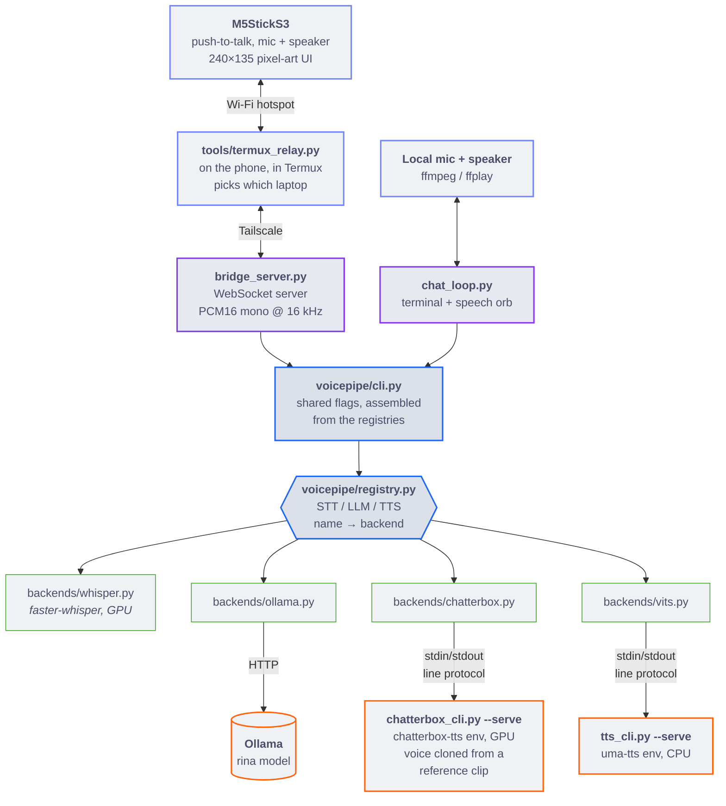
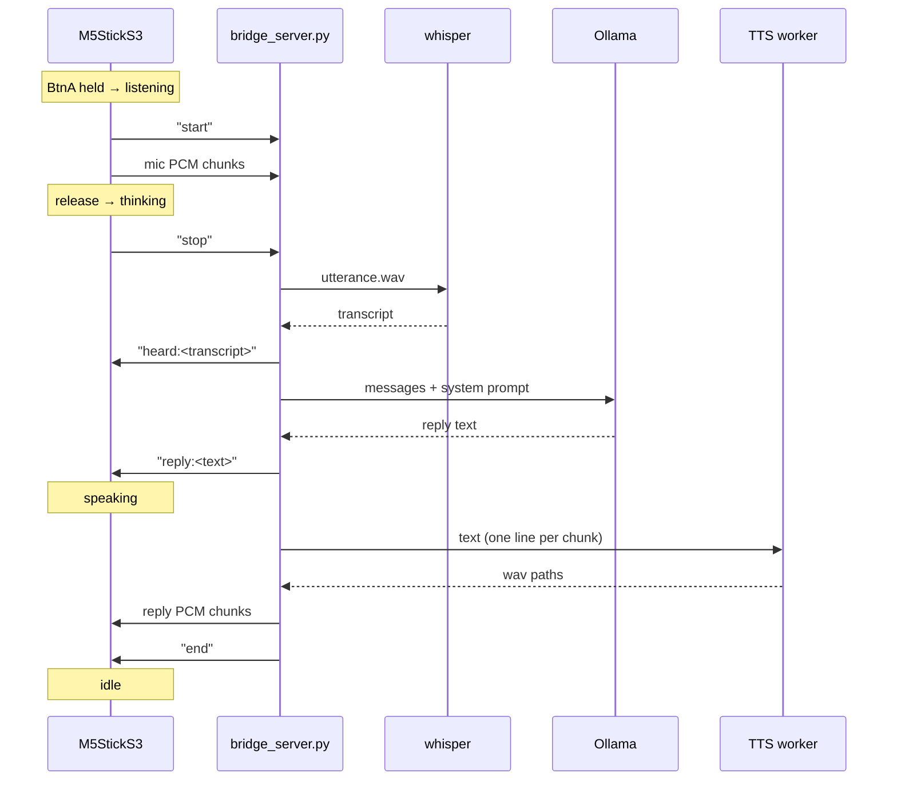

# aicompanion

A voice assistant: mic → faster-whisper (STT) → Ollama (LLM) → VITS-Umamusume (TTS) → speaker.
Runs either through this machine's local mic/speaker (`chat_loop.py`) or through
an M5StickS3 over Wi-Fi (`bridge_server.py` + `firmware/m5stick_bridge/`). TTS is
swappable (`--tts-backend vits` (default) or `chatterbox`, which can clone a
voice from a reference clip) — see "Swapping backends" below.

## What the M5Stick does today

- **Voice chatbot** — hold BtnA to talk, release to send; STT → LLM → TTS →
  speaker, same pipeline as the desktop entrypoint.
- **Speaker verification** ("voice recognition") — replies are gated to the
  enrolled owner's voice (WeSpeaker ECAPA-TDNN-512), so someone else in the
  room doesn't get an answer. See `docs/voice-pipeline.md`.
- **Three screens, cycled by tapping BtnA** (a hold still talks from any of
  them): Rina's animated pixel-art face, a Catppuccin-themed **clock**
  (NTP-synced over Wi-Fi), and a **pomodoro timer** (50 min focus / 10 min
  break by default — BtnB click starts/pauses, BtnB double-click resets).
- **Proactive/unprompted speech** — reminders, encouragement, or a
  build-finished ping can all speak without a button press (see "Unprompted
  lines" below).
- Powering the device off is the **physical power button** (double-click),
  not a firmware feature — see `docs/firmware-notes.md`.

Currently in progress, not yet on the Stick: a BLE transport to replace the
Wi-Fi hotspot (`docs/ble-migration.md`), and the features tracked in
`TODO.md` (wake word activation, an IMU wrist-raise gesture wake, haptic
feedback, voice isolation).

## Architecture

Two entrypoints share one pipeline. They differ only in where audio comes from
and goes back to — everything below the dashed line is identical for both.



The heavy TTS models each run in their **own conda env** as a long-lived
subprocess, because their torch/CUDA pins conflict with each other and with
the `chat` env. `voicepipe/subproc.py` owns that plumbing, so a backend only
declares the command to run. faster-whisper and Ollama need no such isolation
— whisper runs in-process, Ollama is just HTTP.

One turn over the Stick's WebSocket, including where the on-device UI changes
state:



Every turn sends exactly one `end`, including failures — the Stick stays in
its speaking state until it arrives.

## Layout

```
voicepipe/            the STT/LLM/TTS pipeline, plain importable modules — no
                       CLI, no audio I/O assumptions. This is the thing to
                       import when debugging "is it the speech pipeline?"
  registry.py             STTBackend/LLMBackend/TTSBackend interfaces + the
                          name -> backend registry, including the per-backend
                          CLI plumbing (see "Swapping backends" below)
  backends/               the concrete engines, one file each, discovered
                          automatically — adding a file here is all it takes
    whisper.py              faster-whisper           ("faster-whisper", STT)
    ollama.py               Ollama chat + check()    ("ollama", LLM)
    hermes_agent.py         Hermes Agent, or any OpenAI-compatible
                            endpoint (OpenRouter, vLLM, llama.cpp,
                            LM Studio, LiteLLM)      ("hermes-agent", LLM)
    chatterbox.py           Chatterbox Turbo         ("chatterbox", TTS)
    vits.py                 VITS-Umamusume           ("vits", TTS, default)
  cli.py                  the flags every entrypoint shares, assembled from
                          the registries — this is why no entrypoint mentions
                          a concrete backend
  __main__.py             `python -m voicepipe speak/transcribe/ask`, for
                          running one stage on its own
  subproc.py              shared worker plumbing for engines that live in
                          their own conda env (spawn, handshake, teardown)
  text.py                 sentence-aware chunking, shared by every TTS backend
  personas.py             the built-in system prompts
  encouragement.py        the unprompted lines behind `--encourage`
  audio.py                local mic/speaker helpers (pulse/ffplay), used by
                          chat_loop.py only — bridge_server.py's audio comes
                          over a WebSocket instead
  cuda.py                 LD_LIBRARY_PATH setup for GPU whisper

chat_loop.py           local-mic terminal (+ optional "speech orb" GUI) entrypoint
bridge_server.py       M5StickS3 WebSocket bridge entrypoint
chatterbox_cli.py       headless Chatterbox Turbo worker, shelled out to from
                         backends/chatterbox.py (own conda env, see
                         requirements/chatterbox.txt) — --tts-backend chatterbox
tts_cli.py              headless VITS worker, shelled out to from
                         backends/vits.py (own conda env, see
                         requirements/uma-tts.txt) — default TTS backend
speech_orb.py           the desktop face chat_loop.py shows — a port of the
                         Stick's own UI (same sprites, palette, particle
                         field and waveform bars), not a lookalike

assets/sprites/         the extracted pixel art, written by
                         tools/make_face_sprites.py alongside sprites.h —
                         the same crops, as PNGs, for speech_orb.py

memory/about-me.md      hand-written facts about you, appended to the system
                         prompt every conversation so she doesn't have to be
                         told them again (--profile / --no-profile)

tools/
  echo_server.py        same WebSocket protocol as bridge_server.py, but skips
                         STT/Ollama/VITS entirely — mic audio goes straight
                         back to the speaker. Use this to tell a network/
                         firmware problem apart from a model problem.
  make_face_sprites.py  extracts the pixel-art face sheet into both
                         firmware/.../sprites.h (RGB565) and assets/sprites/
                         (PNGs) — one run, one set of crops, so the Stick and
                         speech_orb.py can't drift apart
  make_test_clip.sh     regenerates m5stick_speak_test's embedded voice clip
  termux_relay.py        + termux_relay_setup.md — lets the Stick reach the
                         laptop over Tailscale when they're not on the same
                         Wi-Fi (runs on the phone, in Termux)

firmware/
  m5stick_bridge/        the real push-to-talk firmware (talks to bridge_server.py)
  m5stick_echo_test/     mic -> speaker loopback, on-device only, no Wi-Fi at
                         all — the fastest way to sanity-check the hardware
                         (mic, codec, speaker, volume) in isolation
  m5stick_speak_test/    plays one fixed pre-baked sentence (real Rina voice)
                         on button press — isolates the speaker/volume path
  m5stick_http_test/     standalone Wi-Fi/HTTP connectivity smoke test, no
                         relation to the WebSocket protocol — GETs a plain
                         HTTP server and reports Wi-Fi/TCP/HTTP status

tests/                  pytest suite for voicepipe/ and bridge_server.py's
                         wire protocol — see "Running the tests" below

docs/                   detailed investigation logs behind CLAUDE.md's
                         current-state summaries (hardware budget, the local
                         agent investigation, voice pipeline, firmware bugs,
                         the BLE migration, the k3s deployment architecture)
                         — CLAUDE.md itself is a lean index
TODO.md                 the active punch list

models/                 Ollama Modelfiles (`rina`'s persona on top of qwen3:8b)
requirements/           the three conda envs' pinned dependencies

VITS-Umamusume-voice-synthesizer/   cloned HF Space (model code + weights)

services/               bridge_server.py split into HTTP services along
                         voicepipe/registry.py's existing STT/LLM/TTS
                         boundaries, for the k3s deployment below — Phase 1
                         skeleton, not yet what's actually flashed against
                         (see docs/deployment-architecture.md)
  gateway/                 the Stick's WebSocket peer (Phase 1 only, not
                           firmware-protocol-compatible yet)
  stt/, agent/, tts/       thin FastAPI wrappers, one per registry entry

deploy/kubernetes/      k3s manifests for the home-server (GTX 1650) +
                         laptop (RTX 4060) cluster
controller/gpu_scheduler/  custom controller that retargets the agent
                         service to whichever GPU node is up
observability/, benchmarks/, deploy/helm/, deploy/argocd/
                         later phases of the same track, not built yet —
                         see docs/deployment-architecture.md
```

## Running the tests

```bash
conda activate chat
pytest tests/
```

Covers the pure and mockable logic: the backend registry and its CLI plumbing,
`voicepipe.text` (chunking), `voicepipe.personas`, `voicepipe.backends.ollama`
(`strip_think`, `ask`/`check` against a mocked client), `voicepipe.audio`
(`_rms16`), `voicepipe.subproc` (the worker lifecycle, against a fake worker
script), `bridge_server.py`'s wire protocol with STT/LLM/TTS and the
WebSocket mocked out, the `services/*/app.py` HTTP wrappers (FastAPI's test
client against a fake backend, same seam as above), and
`controller/gpu_scheduler/controller.py`'s routing logic (a recording fake
in place of the Kubernetes client) — no GPU, model, cluster, or network
needed, runs in a few seconds. Run it after any change to `voicepipe/`,
`bridge_server.py`, `services/`, or `controller/`.

What's deliberately **not** covered: loading a real faster-whisper, VITS or
Chatterbox model (each needs its own conda env and a GPU), and anything in
`firmware/` beyond compiling (no practical way to unit test ESP32/M5Unified
C++ behavior without a hardware simulator or a large native-mock scaffold —
not worth building for a project this size; CI does still catch a build
break via `pio run`). The three-tier hardware test path below is the
practical equivalent for the firmware side.

## CI

`.github/workflows/ci.yml` runs on every push/PR: the pytest suite above,
building all five Docker images in `services/`/`controller/gpu_scheduler/`
(catches a broken Dockerfile — this dev environment has no working Docker
daemon to test them locally), applying every `deploy/kubernetes/` and
`controller/gpu_scheduler/deploy.yaml` manifest against a throwaway `kind`
cluster (real server-side schema validation, not just YAML syntax — the
pods won't actually schedule since a GPU-less kind node can't satisfy
`nvidia.com/gpu` requests, which is fine, `apply` doesn't wait for that),
and a `pio run` compile check of `firmware/m5stick_bridge/`.

## Swapping backends

`chat_loop.py` and `bridge_server.py` never name a concrete STT/LLM/TTS
implementation — they ask `voicepipe.registry` for one by name:

```bash
python chat_loop.py --llm-backend ollama --stt-backend faster-whisper --tts-backend vits
```

**Adding a backend is one file.** Drop it in `voicepipe/backends/` and it is
discovered, registered, listed in `--help`, and constructible with no edit to
any entrypoint:

```python
# voicepipe/backends/hermes.py
from voicepipe.registry import LLM

@LLM.register("hermes")
class HermesLLM:
    @staticmethod
    def add_arguments(group):        # optional: your own CLI flags
        group.add_argument("--hermes-tools", default="all")

    @classmethod
    def from_args(cls, args):        # optional: build from those flags
        return cls(tools=args.hermes_tools)

    def __init__(self, tools="all"):
        self.tools = tools

    def ask(self, messages, think=None):
        ...  # e.g. an Ollama call with tools=[...] and a tool-execution loop
```

`--llm-backend hermes` is now a valid choice everywhere, `--hermes-tools`
shows up under its own heading in `--help`, and `python -m voicepipe ask
--llm-backend hermes` works too. The interfaces (`STTBackend.transcribe`,
`LLMBackend.ask`, `TTSBackend.synth`/`close`) are structural
(`typing.Protocol`), so a backend inherits from nothing — it just needs the
methods. Backends take ordinary keyword arguments rather than an argparse
namespace, so they stay usable from plain Python; `from_args` is only the
adapter between the two.

A TTS engine that needs its own conda env (conflicting torch/CUDA pins, as
both current ones have) gets the subprocess plumbing for free by subclassing
`voicepipe.subproc.WorkerVoice` and implementing one method:

```python
@TTS.register("piper")
class PiperVoice(WorkerVoice):
    name = "piper"

    def command(self):
        return [PIPER_PYTHON, PIPER_CLI, "--serve", "--voice", self.voice]
```

## Unprompted lines

Nothing in the wire protocol cares who started a turn, so the server can speak
without the button being pressed — no firmware change needed.

```bash
python tools/say.py "the build finished"      # one-off, via the announce socket

python bridge_server.py --encourage           # a line of encouragement every 15-20 min
python bridge_server.py --encourage --encourage-interval 30 45
```

TTS audio is run through ffmpeg's `speechnorm` before it reaches the Stick —
the speaker is already at full volume, but the synthesizer leaves several dB
of headroom unused (a measured reply went from -4.5 dB peak to -0.4 dB).
`--no-normalize` sends it raw.

The encouragement lines live in `voicepipe/encouragement.py` — edit that list
to change what she says. They are static rather than model-generated on
purpose: instant, free, offline, and they can't wander off-persona at 3am.
The interval is drawn fresh from the range each time so it doesn't read as a
cron job, and an unprompted line waits for any turn in flight rather than
interleaving its audio with the reply's.

## Debugging the speech pipeline

Each stage runs on its own, with every backend's flags available:

```bash
conda activate chat
python -m voicepipe transcribe some.wav                  # STT only
python -m voicepipe ask "hi there" --model rina           # LLM only
python -m voicepipe speak "hello there"                   # TTS only (writes wavs, doesn't play)
python -m voicepipe speak "hello" --tts-backend vits --vits-speaker 10
```

## The desktop face

`chat_loop.py` opens `speech_orb.py`'s window automatically when a display and
PySide6 are available (`--no-orb` keeps everything in the terminal). It isn't a
separate design: it draws into the Stick's own 240×135 canvas using the same
sprites, the same Catppuccin Macchiato palette, the same procedural particle
field and waveform bars, then scales that up nearest-neighbour — so the two
screens show the same thing at different sizes.

```bash
python speech_orb.py              # demo: state buttons + live mic
python speech_orb.py --frameless  # translucent, draggable, always-on-top
```

If the window shows "no sprites", the art hasn't been extracted yet:

```bash
python tools/make_face_sprites.py
```

Because both outputs come from that one command, the Stick and the window
can't drift apart — changing a crop changes both.

## Debugging the M5StickS3

From most to least isolated:

1. **`firmware/m5stick_echo_test/`** — flash this alone. Hold BtnA, talk,
   release, hear it played back. No Wi-Fi, no server, nothing but the mic,
   codec, and speaker. If this doesn't sound right, it's a hardware/firmware
   issue, not network or models.
2. **`tools/echo_server.py`** + `firmware/m5stick_bridge/` — the real
   firmware, but talking to the echo server instead of `bridge_server.py`.
   Isolates the Wi-Fi/WebSocket path from STT/Ollama/VITS.
3. **`bridge_server.py`** + `firmware/m5stick_bridge/` — the real thing.

See `firmware/m5stick_bridge/include/secrets.h.example` for the Wi-Fi/server
config the Stick needs (copy to `secrets.h`, gitignored).

## Using the Stick with either laptop

The Stick always joins the phone's own hotspot and talks to a small relay
running there (in Termux, `tools/termux_relay.py`) — never a laptop's Wi-Fi
directly. The relay forwards over Tailscale to whichever laptop is running
`bridge_server.py`, chosen with `--laptop-host main`/`arch` (see
`tools/termux_relay_setup.md`). This is also what makes switching backends
(this laptop vs. the other one) a one-flag change on the phone instead of a
firmware reflash: the Stick finds the relay automatically (it's always its
own Wi-Fi's gateway, i.e. `WiFi.gatewayIP()` — see `connectNetwork()` in
`firmware/m5stick_bridge/src/main.cpp`), and the relay is what actually picks
the laptop.

## Setup

`./setup_envs.sh` creates the three conda envs (`chat`, `chatterbox-tts`,
`uma-tts`) and clones the VITS-Umamusume Space. See its header comment and
`requirements/*.txt` for details.
